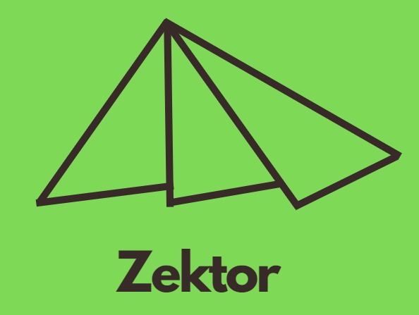
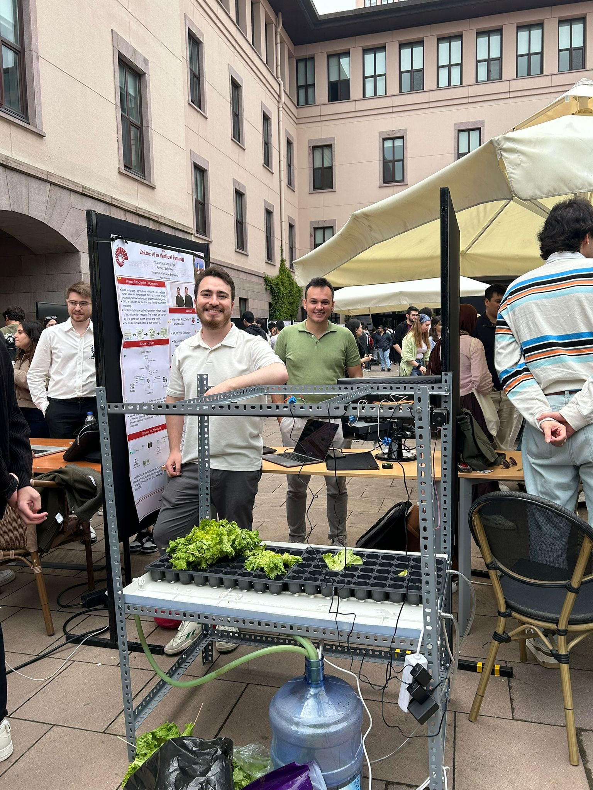

  

# Zektor

Zektor is an AI-based solution for Vertical Farming that aims to reduce labor requirements while increasing operational efficiency. Our system optimizes farming processes through  automation and data-driven decision making by providing comprehensive insights about facilities through health and development phase analysis of plants. This analysis helps farmers monitor plant health in real-time and make informed decisions about their crops' development stages, enabling more precise and efficient farming operations.

## About Us

This project was developed by Batuhan Arat and Volkan Işık. It started as a COMP491 Design Project at Koç University, and has evolved into a venture under the KWorks Pre-Accelerator program.

## Project Overview

### Project Poster

  

### Project Flyer

  

### Demo Day

  
  
A picture from Demo Day

## Documentation & Demo

### Project Report
📄 [View our detailed project report](resources/Comp491-AI%20in%20Vertical%20Farming%20Final%20Report.pdf)

### Demo Video
🎥 [Watch our demo video](https://www.youtube.com/watch?v=nUPkbnY_RNE)